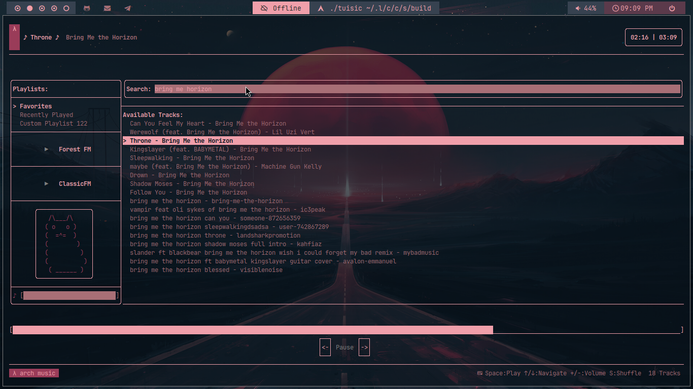

# TUISIC

TUI Online Music Streaming application.

It let's you search and play online songs from cli hassle free.



## Sources
It fetches songs from some platforms:
- SoundCloud
- LastFM
- ForestFM
- YouTube ( Yet to be implemented )

## Dependencies 
```sh
sudo pacman -S curl mpv
```

## 
Build, Compile & Run

```sh
mkdir build && cd build
cmake ..
make
./tuisic
```

## What it uses ?

- FTXUI
- libmpv
- libcurl


## Contribution 
It's open for contribution, read CONTRIBUTION.md for more information.
